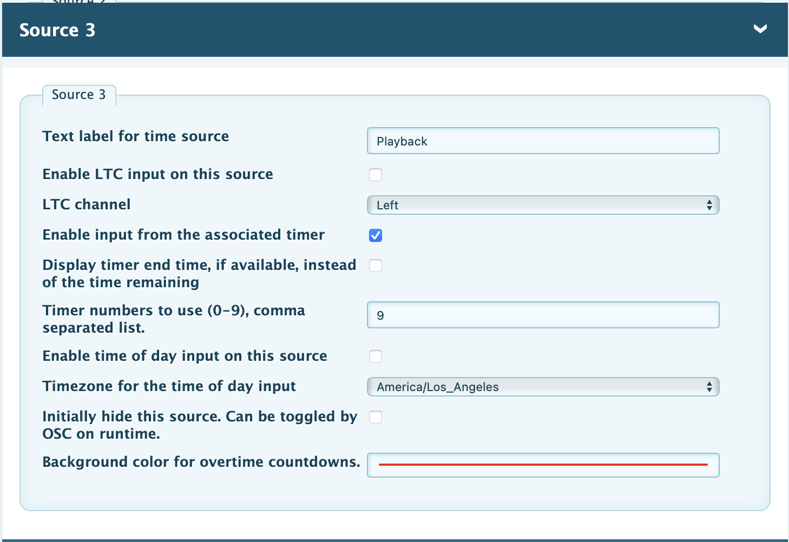
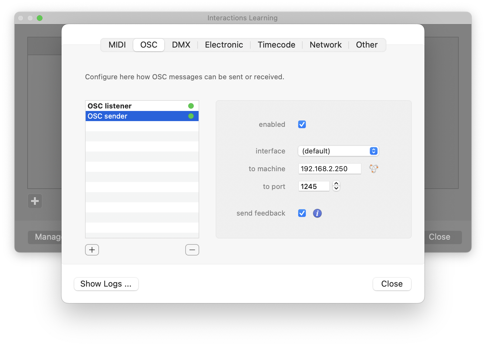

# Millumin Setup

This guide explains how to send a countdown from Millumin to a piClock counter.

## Configure the piClock counter

1. Open the piClock web UI.
2. Choose the timer you want the Millumin countdown to appear in.
   Under **Time sources**, select the source number for the counter you want the countdown to appear on.
3. Use the following timer settings:

## Configure Millumin

1. In Millumin, click **Interactions** (piano keys icon) > **Manage Devices** > **OSC** tab.
2. Add or select an OSC device and use the following settings. Substitute the IP address with your piClock's IP address:

## Troubleshooting

If the countdown is not reaching the piClock, try toggling the **Send feedback** checkbox in the Millumin OSC device settings. In at least one case this caused the OSC data to start flowing.
